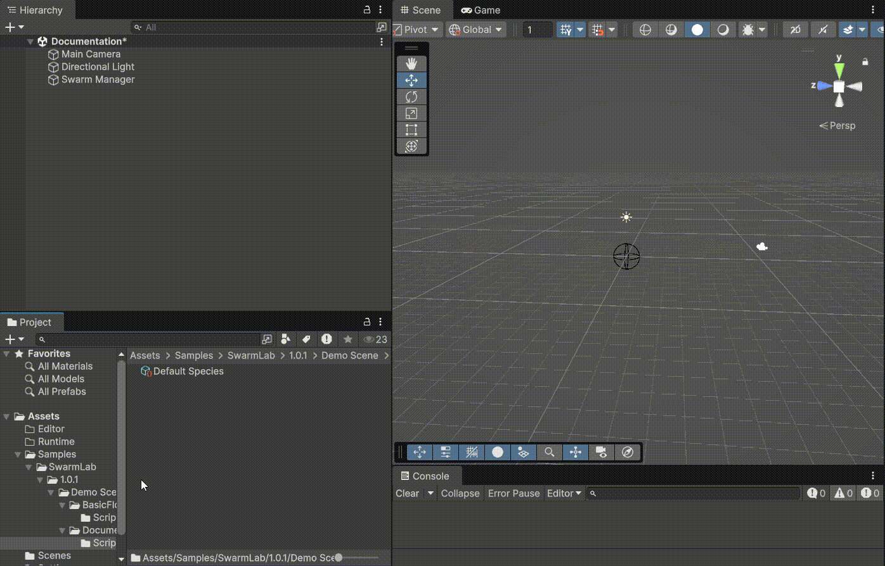
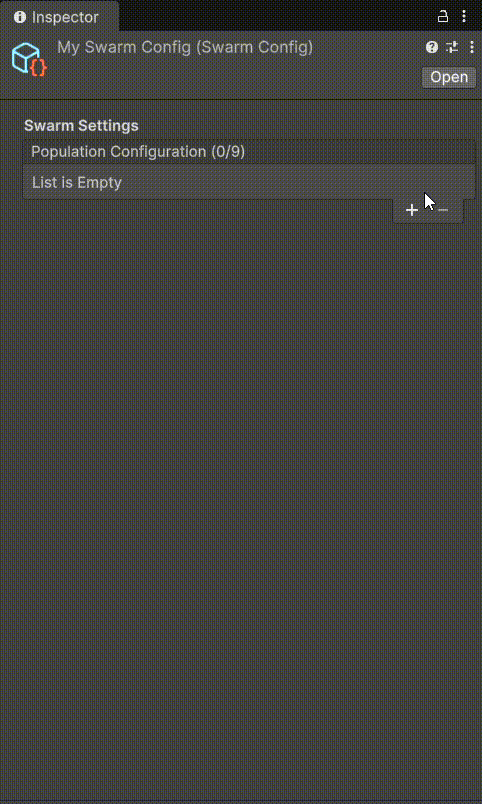
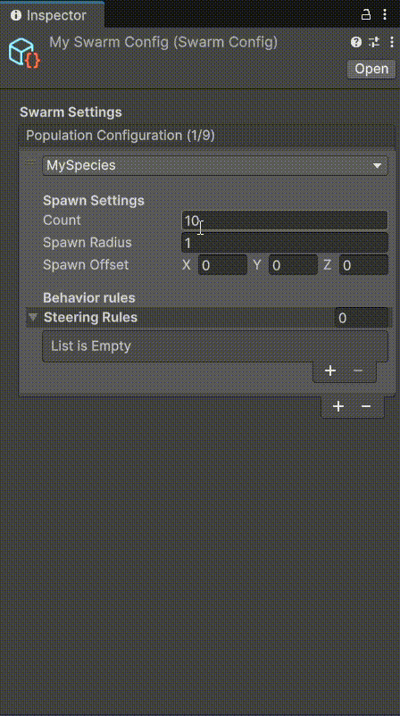
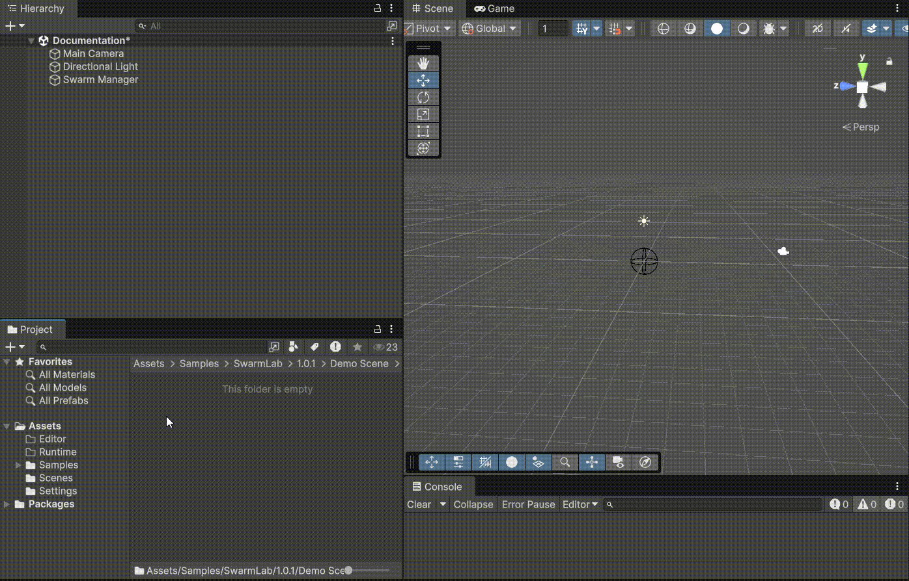
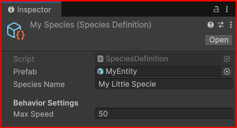
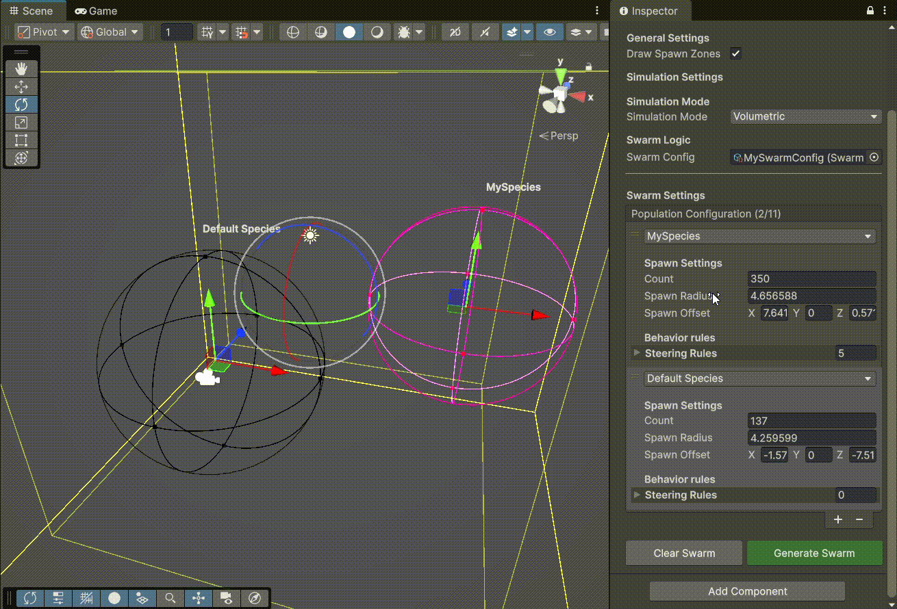
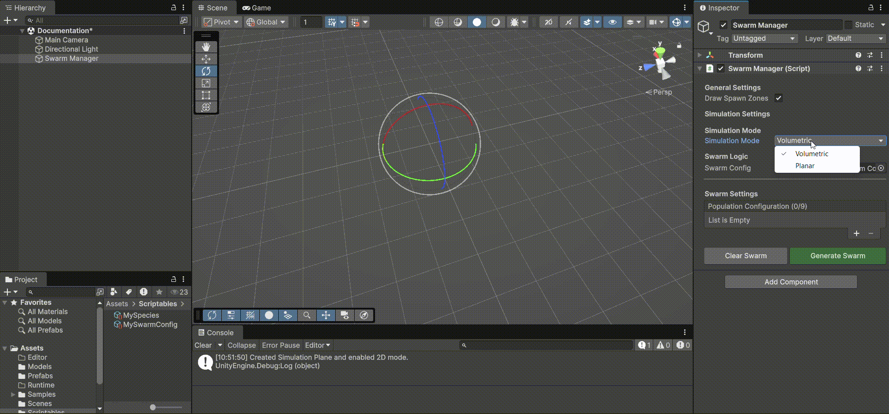

# SwarmLab Documentation

## Overview
SwarmLab is a Unity package designed to simplify the creation and management of rule-based particle systems (swarms) within the runtime environment. It allows for the simulation of complex autonomous behaviors such as flocking, following, and avoiding, usable in both volumetric (3D) and planar (2D) modes.

<p align="center">
    
    <br>
    <em>Runtime modifications</em>
</p>

## Package contents
The package is organized as follows:
- **Runtime**: Contains the core logic for the simulation, including `SwarmManager`, `SwarmConfig`, and the base `SteeringRule` classes.
- **Editor**: Custom inspectors and gizmos to facilitate visual debugging and setup.
- **Samples**: Example scenes and assets to demonstrate the package capabilities.

## Installation instructions
### Via Package Manager (Git)
1. Open the Unity Package Manager.
2. Click the `+` button in the top left.
3. Select "Add package from git URL..."
4. Paste the following URL: `https://github.com/xaxam2001/SwarmLab.git?path=/SwarmLab-UP`

### Via Source Code (Local)
If you want to modify the package source code:
1. Download the repository as a ZIP or Clone it.
2. Copy the `SwarmLab-UP` folder into your Unity project's `Packages` folder (or anywhere in your project assets).
3. Open the Unity Package Manager.
4. Click the `+` button in the top left.
5. Select **"Add package from disk..."**.
6. Select the `package.json` file inside the `SwarmLab-UP` folder you just copied.

## Requirements
- **Unity Version**: 6000.2 or higher.

## Limitations
- **Performance**: The current interaction algorithm is **O(N²)**. Optimizations (such as spatial partitioning) are not yet implemented in this version, which explains the limitation on the number of entities. It is recommended to keep the entity count below 300-500 for stable frame rates on average hardware.
- **Physics**: The system uses a custom velocity/position integration and does not rely on Unity's Rigidbody physics engine for movement, though it can govern objects that *have* colliders.

## Workflows

### 1. Creating a Swarm Configuration
The `SwarmConfig` asset defines *who* is in the swarm.
1. Right-click in the Project window.
2. Navigate to **Create > SwarmLab > Swarm Config**.
<p align="center">
  
</p>
<table width="100%">
<tr>
<td width="50%" valign="top">
3. In the Inspector, you can add "Species Configs".<br><br>

</td>
<td width="50%" valign="top">
4. For each species, assign a <b>Species Definition</b>.
<br>
- You can add <b>Steering Rules</b> to each species to define behavior.
<br><br>

</td>
</tr>
</table>

5. To create a Species Definition:
   - Right-click > **Create > SwarmLab > Species Definition**.
   <p align="center">
  
</p>
   <table width="100%">
   <tr>
   <td width="50%" valign="top">
   
   </td>
   <td width="50%" valign="top">
   <ul>
   <li><b>Prefab</b>: Assign the GameObject to spawn.</li>
   <li><b>Species Name</b>: The unique identifier for this species (used in rules).</li>
   <li><b>Max Speed</b>: The absolute speed limit for entities of this species.</li>
   </ul>
   </td>
   </tr>
   </table>

### 2. Setting up the Swarm Manager
The `SwarmManager` is the brain of the simulation.
1. Create an empty GameObject in your scene name "SwarmManager".
2. Add the `SwarmManager` component.
3. Assign your **Swarm Config** asset to the `Swarm Config` field.
4. **Volumetric vs Planar**: 
   - By default, the simulation is **Volumetric** (3D sphere).
     - In this mode, you can move the spawn zones and adjust the entity count.
     - **Note**: You must click **Generate Swarm** again after moving spawn zones to apply changes.
     <p align="center">
       
     </p>
   - To switch to **Planar** (2D), assign a Transform to the `Planar Boundary` field.
   - Shortcut: Right-click the `SwarmManager` component header and select **Create Simulation Plane**. This will automatically generate a boundary plane and switch the mode to Planar.
   <p align="center">
  
</p>

### 3. Running the Simulation
1. In the Inspector, click the **Generate Swarm** button (green).
2. Press **Play**.
3. The entities (already instantiated) will start moving according to the active Steering Rules.
4. You can modify steering rules and parameters during runtime to observe immediate changes in behavior.


<p align="center">
  
  <br>
  <em>Demonstration of real-time modifications on a 2D Boids configuration</em>
</p>


## Advanced topics

### Custom Steering Rules
You can create your own behaviors by inheriting from `SteeringRule`.
The architecture allows you to define custom parameters *per species*.

1. Create a new C# script.
2. Inherit from `SwarmLab.SteeringRule`.
3. Define a nested class that inherits from `SpeciesParams` to hold your per-species data.
4. Implement `SyncSpeciesList` to ensure your data stays in sync with the config.
5. Implement `CalculateForce`.

```csharp
using SwarmLab;
using UnityEngine;
using System.Collections.Generic;

[System.Serializable]
public class MyCustomRule : SteeringRule
{
    // 1. Define custom parameters per species
    [System.Serializable]
    public class MyParams : SpeciesParams
    {
        public float weight = 1f;
        public float customRadius = 10f;
    }

    // 2. The list that will be serialized
    public List<MyParams> speciesParams = new List<MyParams>();

    // 3. Implement Sync logic (Boilerplate)
    public override void SyncSpeciesList(List<SpeciesDefinition> allSpecies)
    {
        // Add new species
        foreach (var def in allSpecies)
        {
            if (!speciesParams.Exists(p => p.species == def))
            {
                speciesParams.Add(new MyParams { species = def });
            }
        }
        // Remove deleted species
        speciesParams.RemoveAll(p => p.species == null || !allSpecies.Contains(p.species));
    }

    // 4. Calculate Force
    public override Vector3 CalculateForce(Entity entity, List<Entity> neighbors)
    {
        Vector3 force = Vector3.zero;
        
        // Find params for this entity (or caching them) is recommended
        // Logic here...
        
        return force;
    }
}
```

### SteeringRule Architecture
The `SteeringRule` includes a robust system to handle species-specific settings.

| Member | Type | Description |
| :--- | :--- | :--- |
| `CalculateForce` | `abstract Vector3` | **Required**. The core logic method. Receives the `Entity` (self) and a list of `neighbors` (all entities). Must return an acceleration `Vector3`. |
| `SyncSpeciesList` | `abstract void` | **Required**. Called by the Editor to ensure your internal list of parameters matches the Swarm Config's species list. |
| `SpeciesParams` | `class` | **Base Class**. Inherit from this to create your own per-species settings container. |
| `OnValidate` | `virtual void` | Use this to perform editor-time validation (e.g. clamping values). |

### Multi-Species Interactions
The system supports multiple species interacting.
Standard rules (like **Alignment**, **Cohesion**, **Separation**) utilize the `SpeciesParams` pattern to define a **weight** and/or **radius** per species.
- This allows you to define that "Species A" ignores "Species B" but is strongly attracted to "Species C".
- Use the list in the rule inspector to fine-tune these interactions per species.

## Reference

### SwarmManager Inspector
| Property | Description |
| :--- | :--- |
| **Draw Spawn Zones** | Toggles the editor gizmos for spawn locations. |
| **Swarm Config** | The configuration asset defining populations. |
| **Simulation Mode** | **Volumetric**: 3D Sphere. **Planar**: 2D Plane (ignores Y axis). |
| **Planar Boundary** | The Transform defining the 2D plane (Ground). Required for Planar mode. |
| **Planar Size** | The X/Z dimensions of the simulation area in Planar mode. Entities wrap around edges. |

### Common Rule Properties
Standard rules (Alignment, Cohesion, Separation) typically expose:
- **Neighbor Radius**: How far an entity can "see" others.
- **Max Force**: The physical limit of how fast the entity can change direction.
- **Species Params**: List of settings (like weight/radius) for specific neighboring species.

*Note: Custom rules can define entirely different parameters suited to your specific needs.*

## Samples
The package includes two samples.

### A **Boids Rules** Sample

This sample contains a simple implementation of the classic boids rules:
- Alignment
- Cohesion
- Separation

Plus a `BoundingBoxRule` to prevent entities from leaving the simulation area.

### Two **Demo Scene** located in `Samples/Boids Demo`.
- This scene demonstrates a multi-species setup with Alignment, Cohesion, and Separation rules.
- To install it, go to the Package Manager > SwarmLab > Samples and click **Import**.

<p align="center">
    
    <br>  
    <em>Demonstration of 3D sample - Aquarium Demo (classic boids)</em>
    <br>
    
    <br>
    <em>Demonstration of 2D sample - Zombies Demo (Prey VS Predator Boids)</em>
</p>